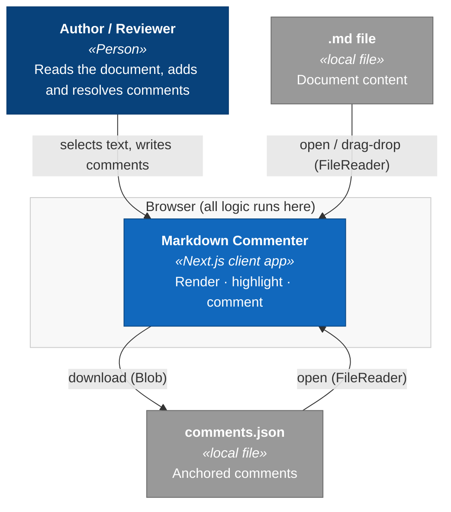
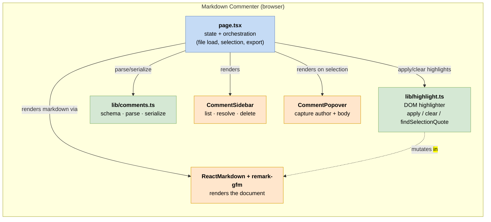
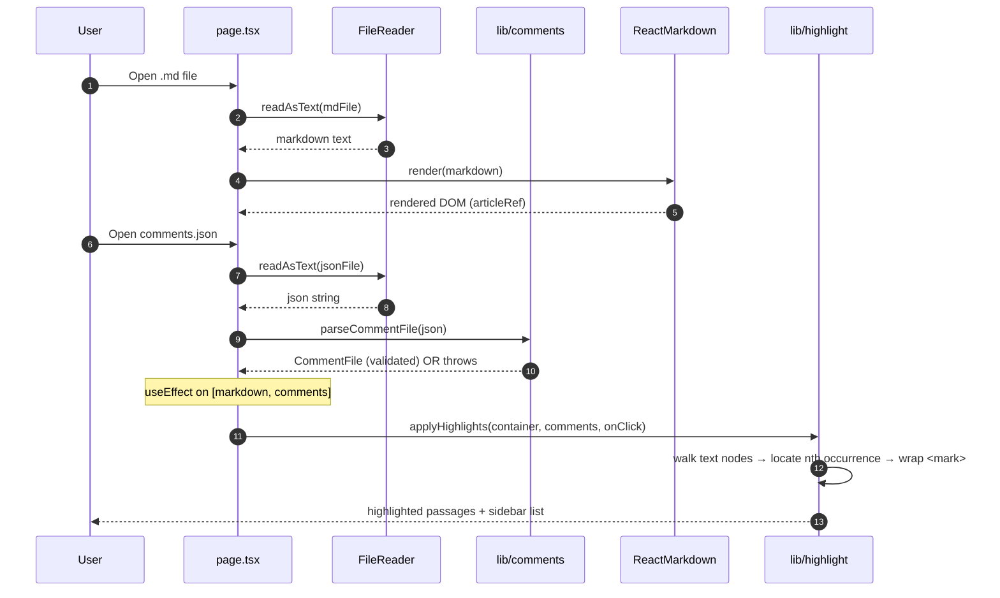
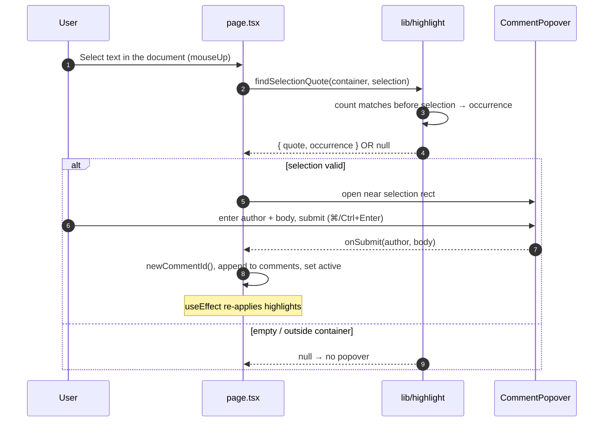
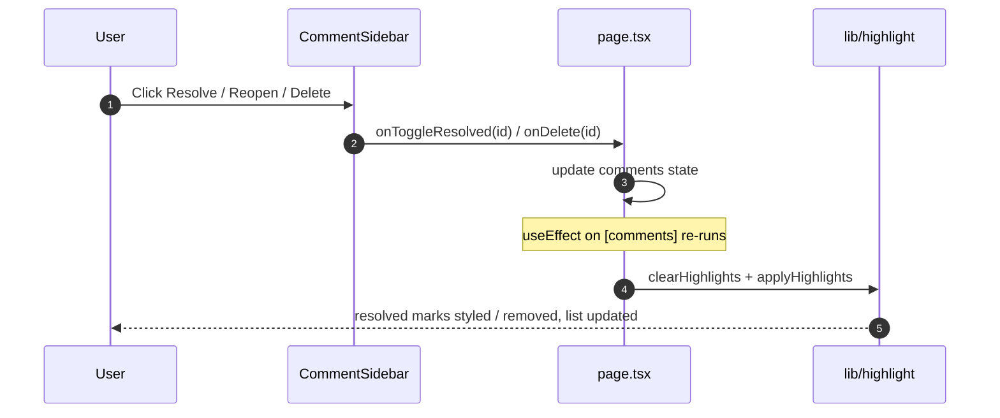
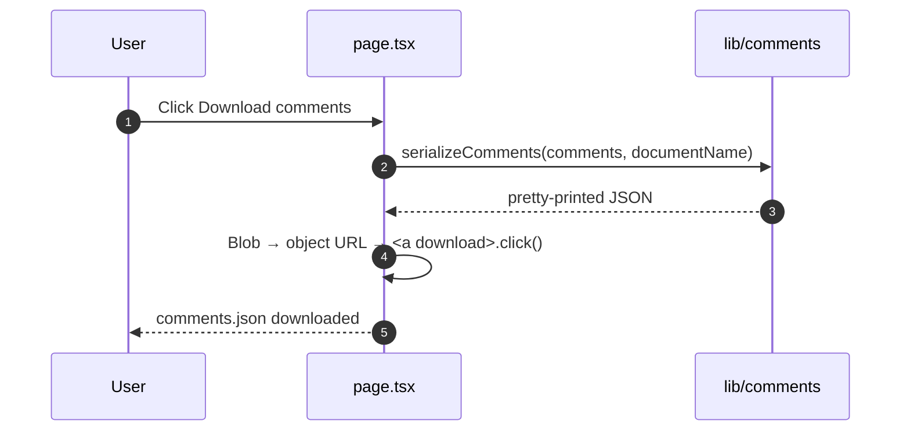
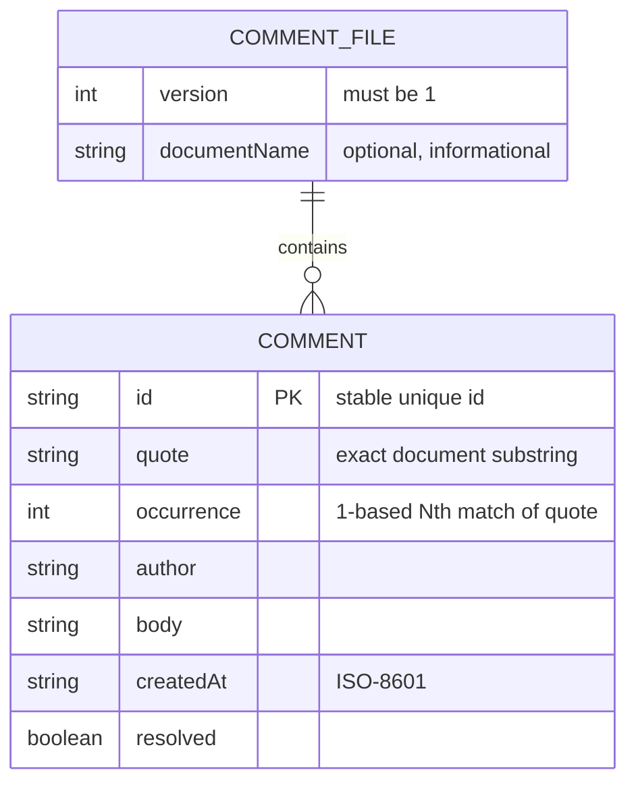
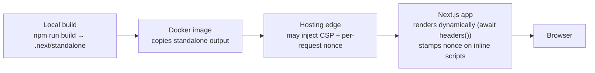

# Markdown Commenter — Architecture Design

## Table of contents

- [Context](#context)
  - [System at a glance](#system-at-a-glance)
  - [Main flows](#main-flows)
- [Quality Goals and Constraints](#quality-goals-and-constraints)
- [Fundamental Decisions](#fundamental-decisions)
- [Building Block View](#building-block-view)
- [Runtime View](#runtime-view)
- [Data Model](#data-model)
- [Deployment](#deployment)
- [Decisions, Risks, and Open Questions](#decisions-risks-and-open-questions)
- [References](#references)

***

## Context

Markdown Commenter renders a Markdown document alongside comments that anchor to
locations within it — the way Confluence shows inline and side comments on a
page. It takes **two separate inputs**: a source `.md` file (the document) and a
standalone JSON **comment file** (comments anchored to text in that document),
and produces a rendered view with highlights over the commented passages plus a
side comment list.

The dominant design choice is that the whole app is **client-side**: files are
read in the browser with `FileReader`, comments are held in React state, and the
edited comment file is exported as a downloaded Blob. There is no server-side
persistence and nothing is uploaded. The only server-side concern is satisfying
a strict Content-Security-Policy at render time (see [Deployment](#deployment)).

### System at a glance



### Main flows

Each flow is written as *trigger → path → outcome*. Detailed sequence diagrams
are in [Runtime View](#runtime-view).

1. **Load and render a document.** The user opens (or drags) a `.md` file → the
   file is read client-side and rendered with react-markdown + remark-gfm → the
   rendered document appears; any already-loaded comments are highlighted over it.

2. **Load comments.** The user opens a `comments.json` file → it is parsed and
   validated against the schema → comments appear in the sidebar and their quotes
   are highlighted in the document (quotes that no longer match are skipped
   silently).

3. **Add a comment.** The user selects text in the rendered document → a popover
   captures the anchor (`quote` + `occurrence`) and author/body → the comment is
   added to state, highlighted, and listed.

4. **Resolve / reopen / delete a comment.** The user acts on a sidebar entry →
   the comment's state updates → the highlight and list reflect it.

5. **Export comments.** The user clicks *Download comments* → the current
   comment set is serialized to JSON → a file download is triggered.

6. **Load / export a zip bundle.** *Open .zip* extracts one root-level Markdown
   and one root-level comments JSON from an archive (`src/lib/zip.ts`), validating
   both before any state is set so an invalid bundle aborts cleanly; *Download
   .zip* packs the current document and serialized comments into one archive.
   Packing/unpacking is in-browser via `fflate` — nothing is uploaded.

***

## Quality Goals and Constraints

### Problem Statement

Reviewing a Markdown document and its feedback means juggling the document and a
separate list of comments with no visual link between a comment and the text it
refers to. The product renders both together so a reviewer sees each comment
against its passage, while keeping comments in a portable file that survives
edits elsewhere in the document.

### Goals

- Render a `.md` document and display comments anchored to specific passages.
- Keep comments in a portable, human-readable, hand-editable file.
- Let anchors survive edits elsewhere in the document.
- Run entirely client-side — no upload, no server persistence.
- Deploy cleanly under a strict Content-Security-Policy.

### Non-Goals

- Multi-user real-time collaboration or a comment backend.
- Reply threads (the comment schema is currently flat).
- Fuzzy re-anchoring when the *quoted text itself* is edited.
- Editing the Markdown document in-app (it is read-only).

### Constraints

- **Client-side only.** No server database; all state is in-browser and exported
  as a file.
- **Strict CSP** (`script-src 'self'`) may be injected at the hosting edge with a
  per-request nonce. The app must render dynamically so Next.js stamps that nonce
  onto its inline bootstrap scripts (see [Deployment](#deployment)).
- **Stack is fixed:** Next.js 16 (App Router, Turbopack) · React 19 ·
  TypeScript 5 · Tailwind CSS 4 · npm.

***

## Fundamental Decisions

Each decision sets a contract the rest of the app conforms to.

### FD-1 — Quote + occurrence anchoring

A comment anchors to the **exact `quote` substring** it refers to plus a 1-based
**`occurrence`** index that disambiguates repeated phrases. This is resilient to
edits *elsewhere* in the document and keeps the comment JSON human-readable and
hand-editable. The alternative anchoring models (line/character ranges, or
heading/block references) were rejected: character ranges break on any edit
above the anchor, and block references require a stable block-id scheme the
source Markdown does not carry. Encoded in `src/lib/comments.ts`.

### FD-2 — Highlight over the rendered DOM, not the raw Markdown

Highlights are applied to the **rendered** DOM because a quote can cross multiple
inline elements (e.g. a phrase spanning `**bold**` and plain text). The
highlighter walks the container's text nodes into one concatenated string with an
index map, locates the requested occurrence, and wraps the range in
`<mark class="md-comment-highlight">` elements — one per text-node segment.
Matching against the raw Markdown source was rejected: raw offsets do not map to
what the reader sees or selects. Encoded in `src/lib/highlight.ts`.

### FD-3 — Client-side only; comments live in a standalone JSON file

All logic runs in the browser; the comment set is a versioned JSON file the user
loads and downloads. This keeps the MVP deployable as a static-feeling app with
no backend, no auth, and no data-at-rest concerns, and makes comment files
portable and diffable. The cost accepted: no concurrent editing and no
server-side durability.

### FD-4 — Force per-request rendering for strict CSP

`layout.tsx` calls `await headers()`, which opts the app out of static
prerendering so Next.js renders per request and stamps an edge-injected CSP
nonce onto its inline scripts. A statically prerendered page would bake nonce-less
inline scripts at build time and fail a strict CSP. The bundled `src/proxy.ts`
middleware (which generates its own nonce + CSP) is **redundant when the hosting
edge already injects a CSP** — it exists only for environments that do not.

***

## Building Block View

### Level 1 — Container overview

The app is a single client-rendered page with two supporting libraries and two
presentational components. There are no network services.



### Container responsibilities

- **`page.tsx`** (`src/app/page.tsx`) — the orchestrator (`"use client"`). Owns
  all state (markdown text, comments, active/pending comment, file names). Reads
  files with `FileReader`, wires the selection→popover→comment flow, re-applies
  highlights on every document/comment change via `useEffect`, and triggers the
  JSON download.
- **ReactMarkdown + remark-gfm** — renders the document with GitHub-flavored
  Markdown (tables, task lists, strikethrough, autolinks). A custom `img`
  component drops empty-`src` images, and custom `code`/`pre` components route
  fenced ` ```mermaid ` blocks to `MermaidBlock` (unwrapping the `<pre>` so the
  diagram isn't nested inside it). `markdownComponents` is defined at module
  scope so the tree isn't remounted (which would discard per-block toggle state).
- **`lib/highlight.ts`** — the DOM highlighter. `applyHighlights` /
  `clearHighlights` wrap and unwrap `<mark>` ranges over the rendered container;
  `findSelectionQuote` derives `{ quote, occurrence }` from the user's selection.
  Wrapping mutates the DOM, so text pieces are re-collected per comment and
  clearing must run before re-applying.
- **`lib/comments.ts`** — the data model and (de)serialization. Defines
  `Comment` / `CommentFile`, validates on load (`parseCommentFile` throws
  human-readable errors, tolerates missing optional fields), serializes for
  download, and mints ids.
- **`CommentSidebar`** — the side comment list: author, date, quoted passage,
  body, and resolve/reopen/delete actions; reflects the active comment.
- **`CommentPopover`** — the add-comment popover anchored near the selection;
  captures author (remembered across comments) and body; ⌘/Ctrl+Enter submits,
  Esc cancels.
- **`OnboardingTour`** (`src/components/OnboardingTour.tsx` + `src/lib/tour.ts`)
  — a three-step overlay (load → comment → download) that spotlights the control
  each step describes via `data-tour` selectors. It auto-launches on a first
  visit and is reopenable via `? Help`; the "seen" flag lives in `localStorage`
  (`lib/tour.ts`, offline, never throws on storage failure).
- **`MermaidBlock`** (`src/components/MermaidBlock.tsx` + `src/lib/mermaid.ts`)
  — renders one ` ```mermaid ` block as a client-side SVG with a per-block
  diagram/source toggle (ephemeral, never persisted). `lib/mermaid.ts` lazily
  `import()`s mermaid inside the render call (FD-3: keeps it out of the server
  bundle / SSR) and initializes it with `securityLevel: "strict"` (FD-4: the
  sanitized SVG carries no inline scripts, so it satisfies the `script-src
  'self'` CSP). Commenting reuses the existing text-node walk: it works only in
  **source** view, where the raw source is real selectable text. A block that
  owns a comment (its quote is a substring of the source) shows a highlight on
  the diagram; `page.tsx` drives a `MermaidContext` (`comments`, `activeId`,
  `onToggle`, `sourceViewRequest`) so selecting such a comment flips the owning
  block to source view and defers the scroll/flash until its `<mark>` renders.
- **Bundled docs** (`src/lib/docs.ts` + `public/docs/`) — a `Docs` menu in
  `page.tsx` loads the project's own docs (pitch deck, architecture) into the
  viewer. `BUNDLED_DOCS` is a hand-maintained registry and `loadBundledDoc`
  `fetch`es each doc's `path`; docs live under `public/docs/` so they're
  same-origin static assets and the `fetch` is allowed by the strict CSP
  (`connect-src 'self'`) with no nonce changes. `openDoc` reuses the file-load
  render path (sets markdown + filename, leaves comments untouched), so the
  bundled docs also serve as ready-made sample documents.

***

## Runtime View

Four scenarios covering the core interactions.

### Scenario 1 — Load document, load comments, highlight (happy path)



**Failure mode — invalid comment file.** `parseCommentFile` throws a
human-readable error (bad JSON, wrong version, missing `comments` array, or a
malformed comment); `page.tsx` catches it and shows an `alert`, leaving the
document and any prior comments intact.

**Degraded case — quote no longer matches.** If a comment's `quote`/`occurrence`
is not found in the rendered text (`nthIndexOf` returns −1), that comment is
**skipped silently** — no highlight — but it still appears in the sidebar.

### Scenario 2 — Add a comment from a selection



### Scenario 3 — Resolve / reopen / delete



### Scenario 4 — Export comments



***

## Data Model

The comment file is the single persisted artifact. It is a versioned JSON object;
the schema lives in `src/lib/comments.ts`.



### Storage decisions

- **No database.** The comment file is loaded from and saved to the user's local
  disk; live state is React state in `page.tsx`.
- **Versioned envelope.** `CommentFile.version` is pinned to `1`;
  `parseCommentFile` rejects other versions so the format can evolve
  deliberately.
- **Anchor fields.** `quote` + `occurrence` are the anchor (see [FD-1](#fd-1--quote--occurrence-anchoring)).
  `id` is stable so the UI can track active/selected comments across renders.
- **Tolerant parsing.** Missing optional fields default (`author` → "Anonymous",
  `body` → "", `createdAt` → epoch, `resolved` → false, `id` → positional),
  so lightly hand-authored files still load.

***

## Deployment

Packaged as a Docker image from the pre-built Next.js `.next/standalone` output —
run `npm run build` locally first; the image does not build. The app is served as
a Next.js standalone server behind whatever hosting edge terminates TLS and
applies the CSP.



**The CSP contract (the one deployment gotcha).** When the hosting edge enforces
`script-src 'self'` and injects a `Content-Security-Policy` header with a
per-request nonce, Next.js stamps that nonce onto its inline bootstrap/hydration
scripts **only if the page renders dynamically**. A statically prerendered page
bakes nonce-less scripts at build time and fails CSP. The workaround: `layout.tsx`
calls `await headers()` to force per-request rendering. Verify a route shows
`ƒ (Dynamic)`, not `○ (Static)`, in `next build` output.

`src/proxy.ts` (middleware generating its own nonce + CSP) is redundant when the
edge already injects a CSP, and would only be needed in an environment that
provides none of its own.

***

## Testing

Tests run on **Vitest** with a **jsdom** environment and Testing Library; the
pure libraries and presentational components are covered directly. There is no
network or server to mock — the whole app is client-side.

```
npm test            # run the suite once
npm run test:watch  # watch mode
npm run test:coverage  # run with a v8 coverage report + thresholds
```

- **`src/lib/comments.test.ts`** — schema validation and (de)serialization:
  valid/invalid shapes, version and `comments`-array rejection, per-field
  defaults, `occurrence` flooring/clamping, and a serialize→parse round-trip.
- **`src/lib/highlight.test.ts`** — the DOM highlighter against jsdom fixtures:
  single and repeated-occurrence wrapping, quotes spanning multiple inline
  elements, missing/empty quotes skipped, resolved marking, click callbacks,
  clear/re-apply, and `findSelectionQuote` occurrence counting.
- **`src/components/*.test.tsx`** — `CommentSidebar` and `CommentPopover`:
  rendering, initials/date formatting, select/resolve/delete callbacks, and
  keyboard interactions (Enter/Space, ⌘/Ctrl+Enter, Esc, click-away).

Coverage thresholds (lines/functions/statements ≥ 90%, branches ≥ 85%) are
enforced in `vitest.config.ts`; the build fails if coverage regresses. The
orchestration in `page.tsx` is exercised indirectly through its extracted
libraries and components rather than by a full end-to-end harness.

***

## Decisions, Risks, and Open Questions

### Key decisions

1. **Quote + occurrence anchoring (FD-1).** Resilient to edits elsewhere;
   hand-editable. Consequence: no resilience when the quoted text itself changes.
2. **Highlight over rendered DOM (FD-2).** Matches what the user sees and selects.
   Consequence: highlighter must re-collect text pieces per comment because
   wrapping mutates the DOM.
3. **Client-side only (FD-3).** No backend, portable comment files. Consequence:
   no concurrent editing, no server durability.
4. **Force dynamic render (FD-4).** Satisfies a strict CSP. Consequence:
   the app opts out of static prerendering.

### Risks and open questions

| # | Type     | Item | Impact | Resolution path |
| - | -------- | ---- | ------ | --------------- |
| 1 | Question | **Anchor resilience** — comments do not survive edits to the *quoted text itself*; there is no fuzzy re-anchoring. | Medium — dropped anchors silently lose their highlight | Decide whether/how to re-resolve dropped anchors (fuzzy match, surrounding context) |
| 2 | Question | **Reply threads** — schema is flat (one body per comment). | Low — limits discussion | Extend schema with a replies array + `version` bump if needed |
| 3 | Risk | **Duplicate/overlapping quotes** — occurrence counting depends on the rendered text being stable between load and selection. | Low | Covered by re-collecting pieces per comment; watch when adding live document editing |
| 4 | Risk | **Static-prerender regression** — a future change could re-enable static rendering and break CSP under a strict-CSP host. | Medium | Keep the `ƒ (Dynamic)` check in the build/verify step |

***

## References

- `CLAUDE.md` — project conventions, stack, deployment gotcha
- `README.md` — features, comment file format, getting started
- `src/lib/comments.ts` — comment schema + parse/serialize (source of truth for the data model)
- `src/lib/highlight.ts` — DOM highlighter
- `src/lib/zip.ts` — zip bundle pack/unpack (document + comments in one archive)
- `src/lib/tour.ts` — onboarding tour steps + localStorage "seen" flag
- `src/lib/mermaid.ts` — lazy, client-only mermaid render wrapper (strict CSP)
- `src/lib/docs.ts` — registry + fetch of bundled docs served from `public/docs/`
- `src/components/MermaidBlock.tsx` — per-block diagram/source toggle + comment anchoring in source view
- `src/app/page.tsx` — orchestration and state
- `vitest.config.ts` — test runner + coverage thresholds; `*.test.ts(x)` next to sources
