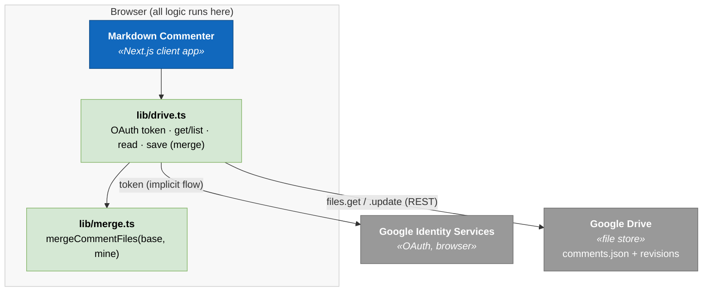
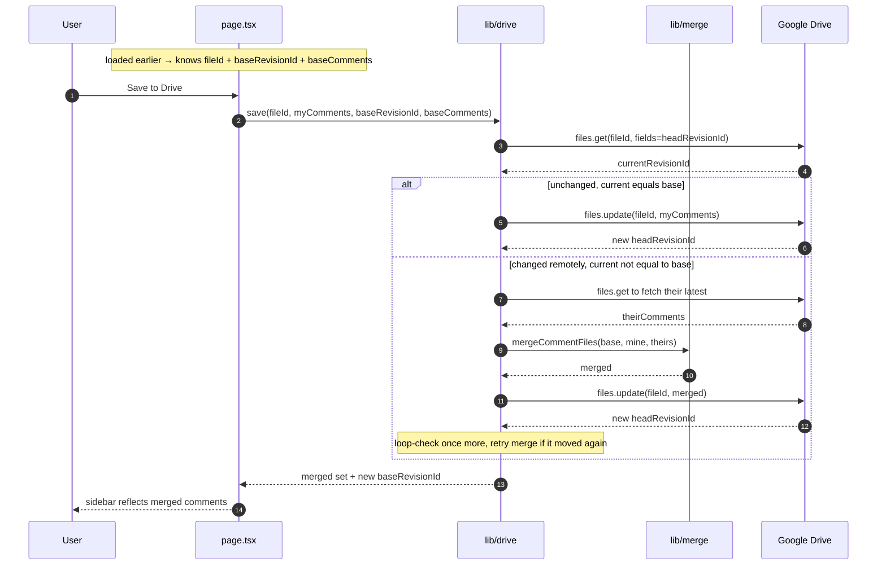

# Design — Async collaboration via Google Drive (no database)

**Status:** Proposed · **Date:** 2026-07-06

This doc proposes adding **asynchronous multi-user collaboration** to Markdown
Commenter *without* a database or backend, by storing the comment JSON file in
**Google Drive** and reconciling concurrent edits with a **merge-by-id**
algorithm. It stays true to [FD-3](architecture.md#fd-3--client-side-only-comments-live-in-a-standalone-json-file)
(client-side only) — Drive replaces the local-disk load/download step, nothing
else moves server-side.

"Collaboration" here means **async**: people open the shared document + comment
file, add/resolve comments, and save; others see those comments the next time
they load. It explicitly does **not** mean real-time presence (seeing another
person's selection or cursor live) — that would require a sync backend and is a
non-goal.

## Table of contents

- [Why this is viable without a database](#why-this-is-viable-without-a-database)
- [Options considered](#options-considered)
- [Chosen approach — Google Drive](#chosen-approach--google-drive)
- [Auth flow](#auth-flow)
- [Where the file lives](#where-the-file-lives)
- [Save flow — optimistic concurrency + merge](#save-flow--optimistic-concurrency--merge)
- [Merge-by-id algorithm](#merge-by-id-algorithm)
- [Schema changes](#schema-changes)
- [Code changes](#code-changes)
- [Risks and open questions](#risks-and-open-questions)

***

## Why this is viable without a database

The usual reason collaboration forces a database is **concurrent writes to
free-form text** — two people editing the same paragraph, one clobbering the
other, needing transactional storage or CRDTs to reconcile.

Our comment file avoids that. Its structure is collaboration-friendly:

- Every comment has a **stable unique `id`** (`newCommentId()`).
- Activity is almost entirely **append** (add a comment) or **flag**
  (`resolved: true/false`) — not in-place mutation of shared prose.

So two divergent copies of `comments.json` can be reconciled by **merging the
`comments` arrays by `id`** (a set union, with a per-comment tie-break for the
`resolved` flag). That is deterministic and needs no server. The only real
hazard is a **lost update** — B overwrites A's save without seeing it — which we
handle with Drive's revision metadata (below), not a database.

***

## Options considered

| Option | Fit | Why / why not |
| ------ | --- | ------------- |
| **Google Drive API** | ✅ Chosen | Stores `comments.json` as an ordinary file; browser-side OAuth, no backend; exposes `headRevisionId`/ETag for optimistic concurrency. Closest to "just works" for Google users. |
| Google **Docs** API | ❌ | Built for document *structure*, not arbitrary JSON. We'd stuff JSON into a doc body and parse it back — hacky, fragile, no real gain over Drive. |
| GitHub repo / Gist | ⚠️ Alt | Great versioning + merge-by-id, but only suits technical collaborators and adds repo setup. Good fallback / power-user path. |
| S3 / R2 presigned URLs, Dropbox | ⚠️ Alt | Same shared-file shape, less identity plumbing, but access control is managed out-of-band. |
| Firebase / Supabase / CRDT | ❌ | These *are* databases / sync backends. Needed only for real-time presence, which is a non-goal. |

***

## Chosen approach — Google Drive

Keep the app fully client-side. Replace only the two I/O touchpoints in
`page.tsx` — "open comments.json" and "download comments" — with "open from
Drive" and "save to Drive". Local file load/download stays as a fallback so the
app still works with no Google account.



***

## Auth flow

Use **Google Identity Services (GIS)** token flow entirely in the browser — no
server, no stored refresh token. This preserves "no backend".

- **Scope:** `https://www.googleapis.com/auth/drive.file` — the *narrow* scope.
  It grants access only to files the app **creates or the user explicitly opens
  via the Google Picker**, not the user's whole Drive. Lowest-trust option and
  avoids Google's restricted-scope verification/security-assessment burden.
- **Flow:** GIS **token model** (implicit) → returns a short-lived access token
  held in memory only. On expiry, request a fresh one (silent if the session is
  still valid). Nothing is persisted, so nothing leaks if the machine is shared.
- **CSP note:** loading `https://accounts.google.com/gsi/client` and calling
  `https://www.googleapis.com/*` means the strict `script-src 'self'` /
  `connect-src` CSP must be widened for those origins. On Airbase this is an
  **edge CSP change**, not just an app change — call it out in deployment. This
  is the one place the collab feature touches the CSP contract
  ([FD-4](architecture.md#fd-4--force-per-request-rendering-for-strict-csp)).

***

## Where the file lives

The comment file is a normal Drive file (`application/json`, e.g.
`my-doc.comments.json`). Two ways in:

1. **Open existing** — Google **Picker** lets the user pick the shared
   `comments.json`. Under `drive.file` scope, picking grants the app access to
   just that file. We store its `fileId` in app state.
2. **Create new** — `files.create` writes a fresh comment file; the returned
   `fileId` is reused for subsequent saves.

**Sharing** is done with Google's own native sharing UI (share the file, or a
folder, with collaborators' Google accounts) — we don't build access control.
The `.md` document can live next to it in the same shared folder, or stay a
local file; they're independent inputs, as today.

***

## Save flow — optimistic concurrency + merge

The one real risk is a lost update. Drive gives every file a `headRevisionId`
(and HTTP ETags). We use it for **optimistic concurrency**: remember the
revision we loaded, and before overwriting, check nobody else has bumped it.



Result: concurrent saves converge instead of clobbering. A save is
read-merge-write; if the revision moved again between our read and write, retry
(bounded, a couple of attempts).

***

## Merge-by-id algorithm

Three-way merge keyed on `id`. `base` = the version this client loaded;
`mine` = local edits; `theirs` = current remote.

```
mergeCommentFiles(base, mine, theirs):
  byId = map from id → comment, seeded from theirs, then overlaid with mine
         per the rules below (union of all ids across mine ∪ theirs)

  for each id in (mine ∪ theirs):
    m = mine[id]; t = theirs[id]; b = base[id]

    - only one side has it (append):        take whichever exists
    - both have it, bodies/fields equal:     take either
    - both have it, differ:                  last-write-wins by `updatedAt`
                                             (newer timestamp wins the whole comment)
    - `resolved` specifically:               OR-merge is safer than LWW —
                                             if either side resolved it and neither
                                             side has a *newer* reopen, keep resolved
  return sorted-by-createdAt array
```

- **Adds** always survive (union) — the common case, never lost.
- **Edits / resolve toggles** need a tiebreaker → we add `updatedAt` (below).
- **Deletes** are the hard case. A plain union **resurrects** a comment the other
  party deleted, because it still exists in their copy. Options:
  - **A. Accept resurrection (MVP).** Deletes don't reliably propagate across
    concurrent copies. Simplest; document it.
  - **B. Tombstones.** Deleting sets `deleted: true` (soft delete) instead of
    dropping the entry; merge keeps tombstones; UI hides them. Deletes propagate
    correctly at the cost of the file accumulating tombstones.

  Recommend **B** if delete-propagation matters, else **A** for the first cut.

***

## Schema changes

Minimal, backward-compatible, and gated behind a version consideration:

- **Add `updatedAt`** (ISO-8601) — set on create and on every edit/resolve. This
  is what makes per-comment last-write-wins deterministic. Optional on load
  (default to `createdAt` when absent), so old files still parse.
- **(Option B only) add `deleted?: boolean`** tombstone flag; default `false`;
  UI filters these out.

Because `parseCommentFile` already tolerates missing optional fields, both can
be added **without bumping `version`** — a `v1` file with no `updatedAt` still
loads. Bump to `version: 2` only if we make either field *required* or change
merge semantics in a way old readers must reject.

***

## Code changes

Scoped, matches current layering (`src/lib/` = pure logic, `page.tsx` =
orchestration):

- **`src/lib/comments.ts`** — add `updatedAt` (and optional `deleted`) to
  `Comment`; default `updatedAt` to `createdAt` in `parseComment`; stamp
  `updatedAt` in create/edit/resolve helpers.
- **`src/lib/merge.ts`** *(new, pure, unit-testable)* — `mergeCommentFiles(base,
  mine, theirs)` implementing the algorithm above. Prime target for the enforced
  coverage thresholds; test add/add, edit/edit LWW, resolve OR-merge, and
  delete/resurrection (or tombstone) cases.
- **`src/lib/drive.ts`** *(new)* — GIS token acquisition, Picker open,
  `files.get`/`create`/`update`, and the read-merge-write save with
  revision-check + bounded retry. Network + Google globals → mock in tests.
- **`src/app/page.tsx`** — add "Open from Drive" / "Save to Drive" alongside the
  existing local load/download (which stays as fallback); track `fileId` +
  `baseRevisionId` + `baseComments` in state.
- **Docs** — once shipped, fold the outcome into
  [architecture.md](architecture.md): flip the "no concurrent editing" note in
  FD-3, add a Drive box to the container diagram, and add the save/merge runtime
  scenario. Update the CSP/deployment note for the Google origins.

***

## Risks and open questions

| # | Type | Item | Impact | Resolution path |
| - | ---- | ---- | ------ | --------------- |
| 1 | Risk | **CSP widening** — GIS + googleapis origins must be allowed in `script-src`/`connect-src`; on Airbase that's an *edge* CSP change. | Medium — feature silently blocked by CSP otherwise | Coordinate the edge CSP allowlist; verify in the browser console |
| 2 | Question | **Delete semantics** — resurrection (A) vs tombstones (B). | Medium — deletes may not propagate | Pick A for MVP, B if users rely on delete |
| 3 | Risk | **Lost update under rapid concurrency** — two saves interleave between read and write. | Low — mitigated by revision-check + retry | Bounded retry; surface a "reload, someone changed this" notice if retries exhaust |
| 4 | Question | **OAuth scope & verification** — `drive.file` avoids restricted-scope review; confirm the Picker flow meets needs. | Low | Stay on `drive.file`; only escalate scope if a real need appears |
| 5 | Risk | **Clock skew for `updatedAt`** — LWW trusts client clocks. | Low | Acceptable for async comments; note it. Drive revision order is the backstop for the file as a whole |

***

## References

- [architecture.md](architecture.md) — current (shipped) architecture; FD-3, FD-4
- `src/lib/comments.ts` — comment schema + parse/serialize (source of truth)
- Google Identity Services (token model), Google Picker, Drive REST (`files`, `revisions`)
</content>
</invoke>
